<p align="center">
  <h1 align="center">OpsPilot Platform</h1>
  <p align="center">
    Cloud-Native Real-Time Incident Response & Team Operations Platform
  </p>
</p>

---

OpsPilot is a production-style cloud-native operational platform inspired by real-world SRE, DevOps, platform engineering, cloud operations, and incident-response systems.

The platform enables engineering teams to:

- Create and manage production incidents
- Coordinate operational remediation tasks
- Manage teams and role-based access
- Receive real-time operational notifications
- Track activity timelines and audit trails
- Collaborate across operational workflows
- Monitor operational readiness
- Stream distributed operational events
- Synchronize live system activity in real time

Built using:

- Spring Boot
- React + Vite
- PostgreSQL
- Kafka (Confluent Platform)
- Redis
- WebSockets (STOMP/SockJS)
- Docker
- AWS EC2
- Swagger/OpenAPI
- Spring Boot Actuator
- Flyway
- Terraform-style infrastructure organization

---

# Key Highlights

- Real-time operational updates using WebSockets + STOMP
- Kafka event-streaming architecture
- Confluent Kafka platform integration
- Secure JWT authentication & role-based authorization
- Distributed event-driven workflows
- Team collaboration workflows
- Incident lifecycle management
- Operational task orchestration
- Live notifications system
- Activity timeline & audit logging
- Dockerized multi-service deployment
- Swagger/OpenAPI integration
- Health monitoring with Spring Boot Actuator
- Redis-backed operational caching
- Production-oriented infrastructure organization
- Environment-aware deployment configuration
- Cloud-native deployment architecture

---

# System Architecture

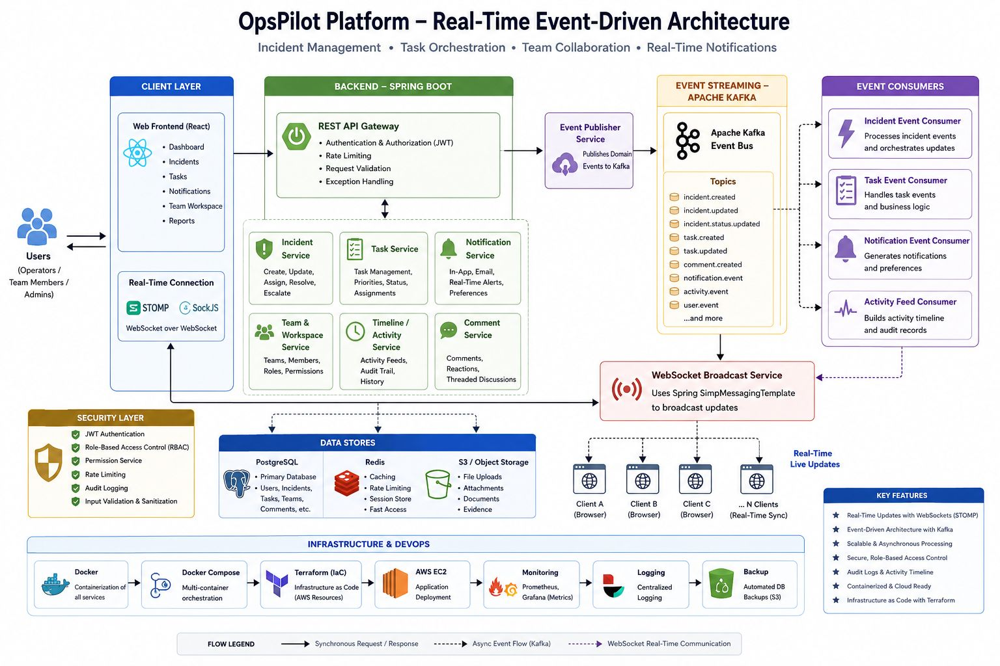

---

# Core Features

## Authentication & Authorization

- User registration and login
- JWT token generation and validation
- Protected REST APIs
- Role-based authorization
- Role-aware frontend rendering
- BCrypt password hashing
- Spring Security authentication filters
- Secure API request validation
- Environment-aware security configuration
- Production-ready CORS handling

### Supported Roles

| Role | Purpose |
|---|---|
| ADMIN | Platform administration and role management |
| INCIDENT_MANAGER | Incident coordination and operational ownership |
| TEAM_LEAD | Team operations and task oversight |
| USER | General operational workflows |

---

# Incident Management

The incident module simulates real-world production incident-response workflows used by modern SRE and platform engineering teams.

## Features

- Create production incidents
- Assign incident owners
- Track incident severity
- Update incident status
- Add operational comments
- Maintain operational timelines
- Search and filter incidents
- Receive live incident updates
- Broadcast operational changes in real time
- Synchronize distributed operational activity

### Supported Incident Status

| Status | Meaning |
|---|---|
| OPEN | Incident created |
| INVESTIGATING | Root-cause analysis in progress |
| IN_PROGRESS | Active remediation underway |
| RESOLVED | Issue resolved |
| CLOSED | Operationally finalized |

### Severity Levels

| Severity | Meaning |
|---|---|
| LOW | Minor issue |
| MEDIUM | Moderate operational degradation |
| HIGH | Significant operational impact |
| CRITICAL | Major outage / urgent escalation |

---

# Task Orchestration

OpsPilot includes operational task management for engineering execution workflows.

## Features

- Create operational tasks
- Assign tasks to users
- Link tasks to incidents
- Track priorities and due dates
- Update task status
- View user-specific task lists
- Receive live task updates
- Coordinate engineering execution
- Operational ownership tracking

### Task States

| State | Meaning |
|---|---|
| TODO | Work pending |
| IN_PROGRESS | Work actively handled |
| DONE | Work completed |

---

# Team Workspace

The team workspace enables collaborative operational execution across engineering teams.

## Features

- Team creation and management
- Bulk user assignment
- Bulk role assignment
- Team-based task coordination
- Shared execution view
- Team ownership tracking
- Operational collaboration workflows
- Distributed engineering coordination

---

# Notifications System

OpsPilot includes a live operational notification infrastructure.

## Features

- Notification bell UI
- Recent notifications API
- Unread notification count
- Mark notifications as read
- User-specific WebSocket subscriptions
- Live push notifications using STOMP/SockJS
- Real-time operational event propagation
- Distributed notification synchronization

---

# Timeline, Comments & Audit Trail

OpsPilot tracks operational collaboration and historical system activity.

## Tracked Activities

- Incident creation
- Incident status updates
- Operational comments
- Task updates
- Team assignment
- Role changes
- Administrative actions
- Operational workflow activity
- Distributed event propagation

This provides operational traceability, historical visibility, and audit readiness.

---

# Real-Time Event Architecture

OpsPilot uses Spring WebSocket messaging with STOMP and SockJS for distributed real-time synchronization.

## Backend WebSocket Endpoint

```text
/ws
```

## Topic Broadcasting

```text
/topic/incidents/**
/topic/tasks/**
/topic/notifications/**
/topic/activity
```

## Real-Time Operational Flow

```text
User Action
    ↓
Spring Boot REST API
    ↓
Service Layer
    ↓
Kafka Event Publication
    ↓
Kafka Consumer Processing
    ↓
WebSocket Topic Broadcast
    ↓
React Real-Time UI Synchronization
```

---

# Kafka Event Streaming Layer

OpsPilot includes distributed Kafka infrastructure for asynchronous event-driven workflows.

## Kafka Components

- Confluent Kafka broker
- Zookeeper coordination
- Topic configuration
- Producer services
- Consumer services
- Listener container factories
- Event relay architecture
- Distributed operational event propagation

## Configured Topics

```text
incident-created
incident-status-updated
task-created
task-status-updated
activity-events
comment-created
notification-events
```

## Kafka Engineering Concepts

- Event-driven architecture
- Distributed asynchronous communication
- Real-time event propagation
- Topic-based operational messaging
- Producer/consumer workflow design
- Event relay pipelines

---

# Operational Dashboard & Analytics

OpsPilot includes operational visibility dashboards for engineering execution monitoring.

## Dashboard Capabilities

- Operational readiness tracking
- Active workload visibility
- Incident analytics
- Real-time activity feeds
- Notification monitoring
- Team execution visibility
- Operational state synchronization
- Live system updates

---

# Backend Architecture

The backend follows layered enterprise architecture principles.

```text
apps/backend/src/main/java/com/opspilot/platform
├── config
├── controller
├── dto
├── events
├── exception
├── model/entity
├── repository
├── security
└── service
```

## Backend Engineering Concepts

- RESTful API design
- DTO separation
- Service-layer business logic
- Repository abstraction
- JPA/Hibernate persistence
- JWT authentication filters
- Role-based authorization
- Kafka event publishing
- WebSocket broadcasting
- Redis-backed caching
- Rate limiting
- Operational workflow modeling
- Distributed event synchronization
- Environment-aware configuration
- Production-grade backend architecture

---

# Frontend Architecture

The frontend is built using React + Vite.

```text
apps/frontend/src
├── api
├── components
├── hooks
├── pages
├── utils
└── websocket
```

## Frontend Engineering Concepts

- Protected route handling
- Role-aware rendering
- API abstraction layer
- Live notification hooks
- STOMP topic subscriptions
- Dashboard UI
- Team workspace UI
- Incident workflow UI
- Operational activity feeds
- Real-time state synchronization
- Distributed UI updates
- WebSocket event subscriptions

---

# Tech Stack

## Frontend

| Technology | Purpose |
|---|---|
| React 19 | UI framework |
| Vite | Build tool |
| React Router | Client-side routing |
| Axios | REST communication |
| STOMP.js | WebSocket messaging |
| SockJS | Browser WebSocket fallback |

---

## Backend

| Technology | Purpose |
|---|---|
| Java 17 | Backend language |
| Spring Boot | API framework |
| Spring Security | Authentication & authorization |
| JWT | Stateless API security |
| Spring Data JPA | ORM/data access |
| Hibernate | Persistence |
| PostgreSQL | Relational database |
| Flyway | Database migrations |
| Spring WebSocket | Real-time messaging |
| Kafka | Distributed event streaming |
| Confluent Platform | Kafka infrastructure |
| Redis | Runtime cache & rate limiting |
| Maven | Dependency management |

---

## DevOps / Infrastructure

| Technology | Purpose |
|---|---|
| Docker | Containerization |
| Docker Compose | Multi-service orchestration |
| AWS EC2 | Cloud deployment target |
| Terraform-style Structure | Infrastructure organization |
| Swagger/OpenAPI | API documentation |
| Spring Boot Actuator | Runtime observability |
| Linux/Ubuntu | Production runtime environment |

---

# Dockerized Services

The production Docker setup runs:

| Service | Purpose |
|---|---|
| opspilot-frontend | React frontend |
| opspilot-backend | Spring Boot API |
| opspilot-postgres | PostgreSQL database |
| opspilot-redis | Redis runtime |
| opspilot-kafka | Kafka broker |
| opspilot-zookeeper | Kafka coordination |

---

# API Documentation

Swagger/OpenAPI documentation is available when backend services are running.

```text
http://localhost:8080/swagger-ui/index.html
```

## API Engineering Concepts

- Production-grade API documentation
- Interactive endpoint testing
- Operational API visibility
- Backend contract validation

---

# Health Monitoring

Spring Boot Actuator exposes operational health endpoints.

```text
GET /actuator/health
```

## Health Monitoring Includes

- Database connectivity
- Disk space monitoring
- Application liveness
- Runtime readiness checks
- Service observability
- Deployment monitoring

---

# Redis Infrastructure

OpsPilot includes Redis-backed operational runtime support.

## Redis Usage

- Operational caching
- Runtime state handling
- Rate-limiting infrastructure
- Distributed cache coordination

---

# Database Migrations

Flyway migrations are located at:

```text
apps/backend/src/main/resources/db/migration
```

This enables version-controlled schema evolution and production-safe database management.

---

# Application Screenshots

## Authentication

### Login Page

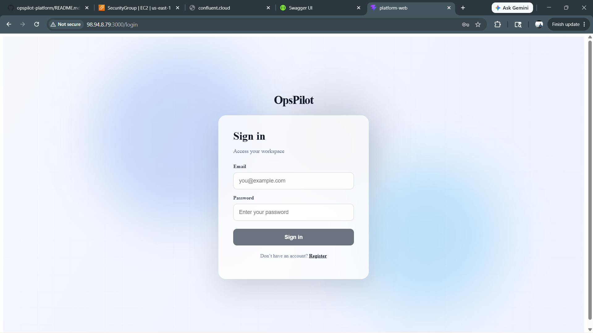

### Registration Page

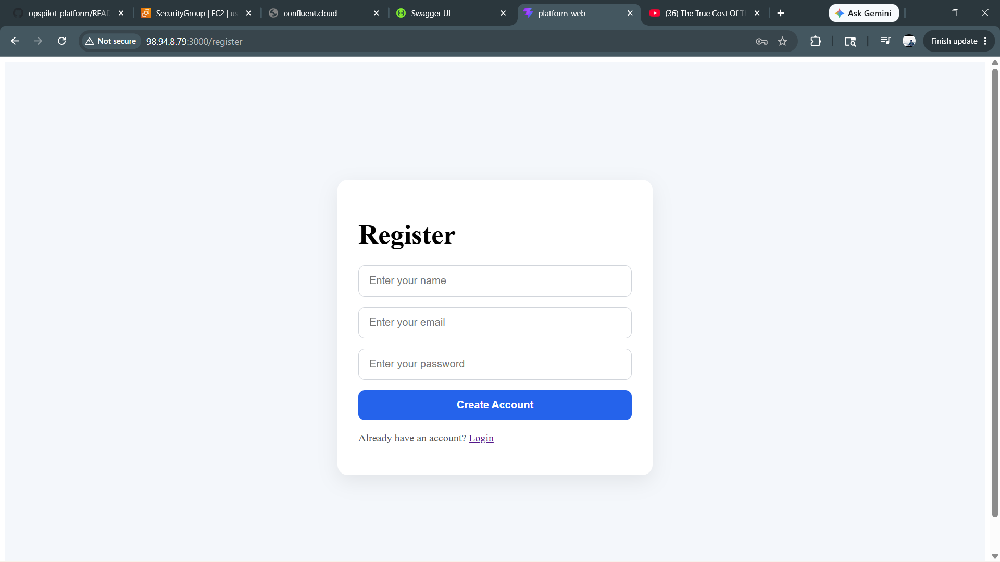

---

## Incident Management

### Incident Dashboard

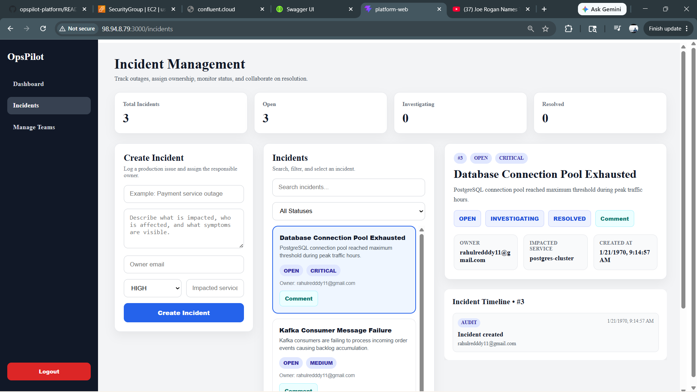

### Incident Comments

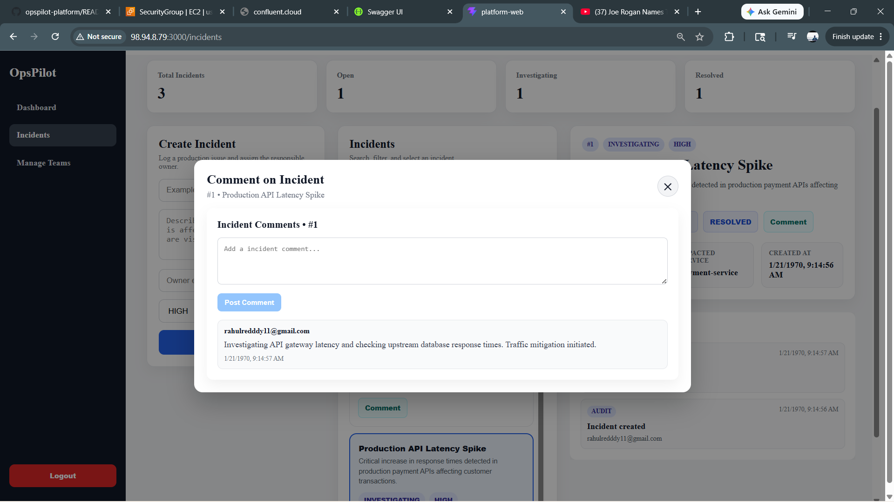

---

## Team Operations

### Team Management

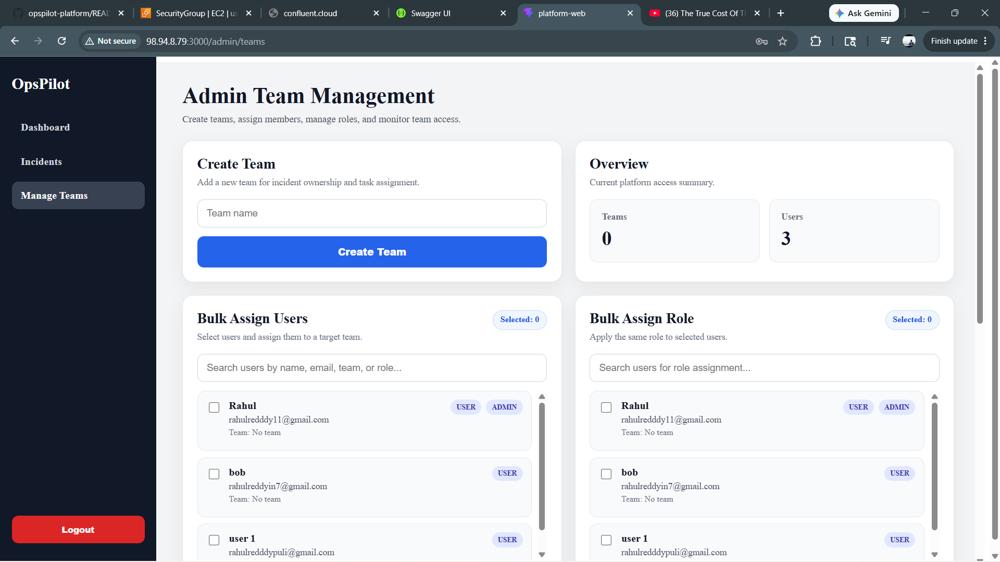

### Team Workspace

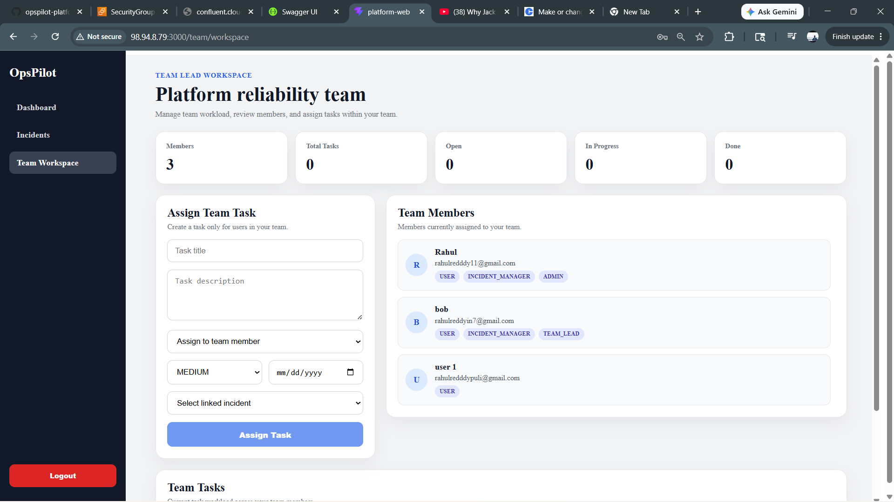

### Task Assignment

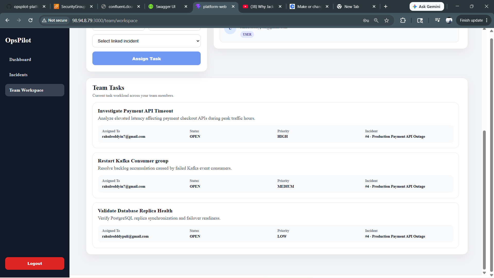

---

## Notifications & Activity

### Live Notifications

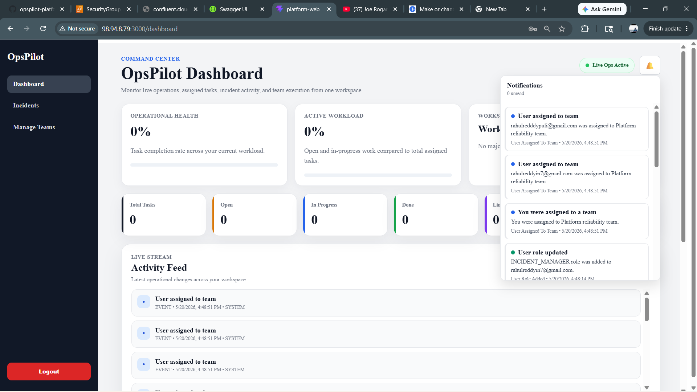

### Operational Dashboard

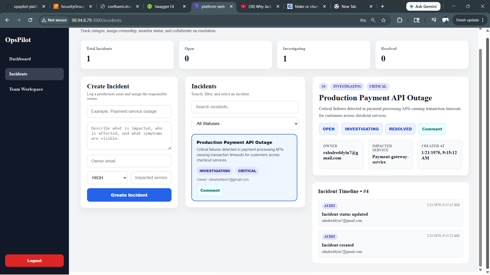

---

## API Documentation

### Swagger/OpenAPI

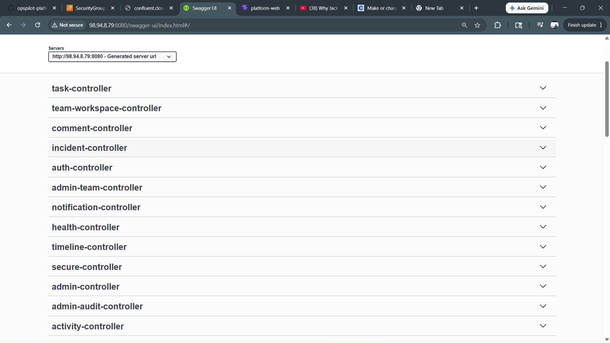

---

## Deployment & Infrastructure

### Docker Containers & Health Checks

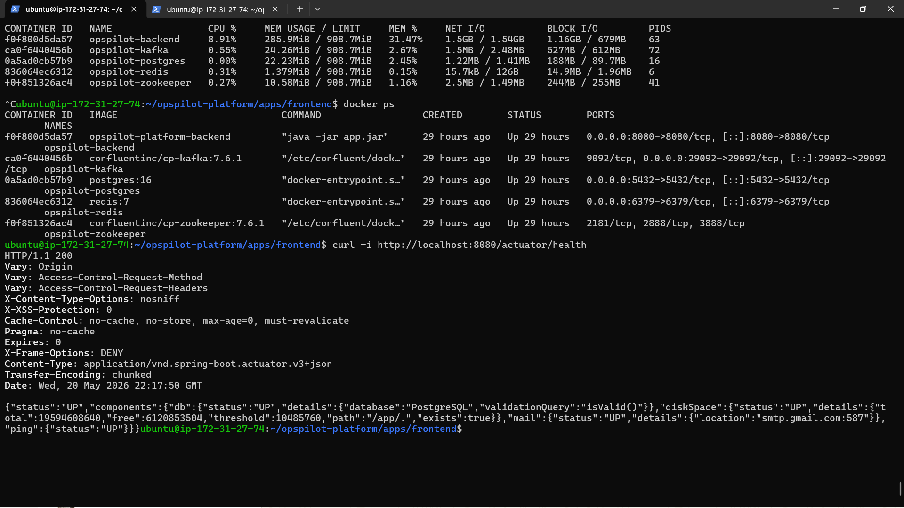

---

# Project Structure

```text
opspilot-platform/
│
├── apps/
│   ├── backend/
│   └── frontend/
│
├── docs/
│   ├── architecture/
│   ├── screenshots/
│   ├── api/
│   └── runbooks/
│
├── infra/
│   ├── docker/
│   └── terraform/
│
├── scripts/
│
├── docker-compose.yml
├── docker-compose.kafka.yml
└── README.md
```

---

# Local Development Setup

## Prerequisites

- Java 17
- Maven
- Node.js
- Docker Desktop
- Git

---

# Clone Repository

```bash
git clone https://github.com/rahulreddyin7/opspilot-platform.git
cd opspilot-platform
```

---

# Start with Docker Compose

```bash
docker compose up --build
```

---

# Local URLs

| Service | URL |
|---|---|
| Frontend | http://localhost:5173 |
| Backend API | http://localhost:8080 |
| Swagger UI | http://localhost:8080/swagger-ui/index.html |
| Health Check | http://localhost:8080/actuator/health |

---

# Production Deployment Notes

Production deployment supports:

- Externalized environment variables
- Docker network isolation
- EC2 deployment
- Persistent PostgreSQL volumes
- Kafka orchestration
- Redis integration
- Mail integration
- JWT secret configuration
- Environment-aware API routing
- Production-safe CORS policies
- Multi-container runtime orchestration

Sensitive secrets should be managed using environment variables or secret managers.

---

# Enterprise Engineering Concepts Demonstrated

- Full-stack enterprise application architecture
- Distributed systems design
- JWT-based authentication
- Role-based authorization
- Event-driven service design
- Kafka listener/topic infrastructure
- Confluent Kafka integration
- WebSocket real-time synchronization
- STOMP topic broadcasting
- Distributed event propagation
- Operational workflow modeling
- Team collaboration workflows
- Incident lifecycle management
- Operational audit tracking
- Cloud-native deployment architecture
- Dockerized infrastructure
- Health monitoring & observability
- API documentation engineering
- Database migration/versioning
- Asynchronous event processing
- Production deployment readiness
- Environment-aware infrastructure configuration

---

# Future Enhancements

- Kubernetes deployment manifests
- Helm chart support
- CI/CD pipeline integration
- HTTPS reverse proxy integration
- Prometheus + Grafana monitoring
- SLA/SLO dashboards
- Multi-tenant organization support
- File attachment support
- AI-assisted incident summarization
- Retry and dead-letter Kafka flows
- Distributed tracing
- Advanced observability dashboards

---

# Resume-Ready Summary

OpsPilot is a production-style cloud-native operational platform inspired by real-world DevOps, SRE, distributed systems, and incident-response architectures.

The project demonstrates:

- Enterprise backend architecture
- Real-time distributed systems
- Event-driven asynchronous workflows
- Kafka/WebSocket integration
- JWT security
- Role-based operational workflows
- Distributed event synchronization
- Cloud-native deployment architecture
- Dockerized infrastructure
- Production-oriented engineering practices
- Full-stack engineering architecture
- Operational monitoring & observability

---

# Author

Rahul Reddy Puli

GitHub:
https://github.com/rahulreddyin7

LinkedIn:
https://www.linkedin.com/in/rahulreddyin7/